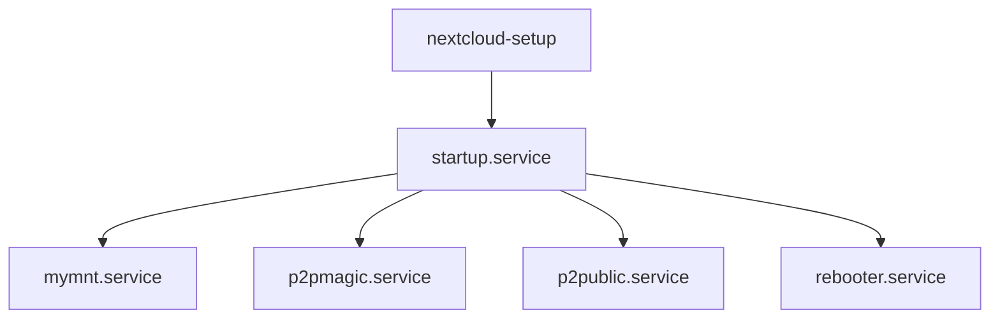

# Nixtcloud

[](https://nixos.org)
[](https://nextcloud.com)
[](https://www.raspberrypi.org)
[](https://holesail.io)
[](https://opensource.org/licenses/MIT)

Transform your Raspberry Pi into a powerful, self-hosted cloud storage server with **one command**. Nixtcloud combines NixOS's reproducibility with Nextcloud's versatility to create an automated personal cloud that's accessible from anywhere through secure P2P connections.

## 🌟 Key Features

- **🚀 One-Command Deployment**: Build a complete, bootable SD card image with a single command
- **🔌 Plug & Play USB Storage**: Automatically mount and integrate USB drives as Nextcloud external storage
- **🌐 Remote Access Without Port Forwarding**: Built-in Holesail P2P connectivity for secure remote access
- **🔄 Self-Healing System**: Automated maintenance, updates, and daily reboots keep your cloud running smoothly
- **🔒 Privacy First**: Your data stays on your hardware, accessible only through encrypted P2P connections
- **📱 QR Code Access**: Connect from anywhere by simply scanning a QR code with the Holesail app

## 📋 Table of Contents

- [Quick Start](#quick-start)
- [Requirements](#requirements)
- [Installation](#installation)
  - [From NixOS](#from-nixos)
  - [From Linux/macOS](#from-linuxmacos)
- [First Access](#first-access)
- [Features in Detail](#features-in-detail)
- [Configuration](#configuration)
- [System Architecture](#system-architecture)
- [Troubleshooting](#troubleshooting)
- [Security](#security)
- [Contributing](#contributing)

## 🚀 Quick Start

```bash
# On NixOS
nix build --system aarch64-linux github:jjacke13/nixtcloud#packages.aarch64-linux.Rpi4

# On other Linux/macOS (after installing Nix)
nix build --extra-experimental-features nix-command --extra-experimental-features flakes \
  --system aarch64-linux github:jjacke13/nixtcloud#packages.aarch64-linux.Rpi4
```

That's it! Burn the resulting image to an SD card, boot your Pi, and access your cloud at `nixtcloud.local`.

## 📦 Requirements

### Hardware
- **Raspberry Pi 4 or 5** (minimum 4GB RAM recommended)
- **SD Card** (32GB or larger recommended)
- **Ethernet connection** to your router
- **USB storage devices** (optional, for expanding storage)

### Software
- **Nix package manager** (for building the image)
- **SD card flashing tool** (like [Etcher](https://www.balena.io/etcher/) or `dd`)

## 🛠️ Installation

### From NixOS

1. **Build the image** for your Raspberry Pi model:
   ```bash
   # For Raspberry Pi 4
   nix build --system aarch64-linux github:jjacke13/nixtcloud#packages.aarch64-linux.Rpi4
   
   # For Raspberry Pi 5
   nix build --system aarch64-linux github:jjacke13/nixtcloud#packages.aarch64-linux.Rpi5
   ```

2. **Decompress the image**:
   ```bash
   zstd -d result/sd-image/*.img.zst
   ```

3. **Flash to SD card**:
   ```bash
   sudo dd if=result/sd-image/*.img of=/dev/sdX bs=4M status=progress
   ```
   Replace `/dev/sdX` with your SD card device.

4. **Insert the SD card** into your Raspberry Pi and power it on!

### From Linux/macOS

1. **Install Nix** (if not already installed):
   ```bash
   sh <(curl -L https://nixos.org/nix/install) --no-daemon
   ```

2. **Build the image**:
   ```bash
   nix build --extra-experimental-features nix-command --extra-experimental-features flakes \
     --system aarch64-linux github:jjacke13/nixtcloud#packages.aarch64-linux.Rpi4
   ```

3. Follow steps 2-4 from the NixOS instructions above.

## 🌐 First Access

### Local Network Access

1. Connect your Pi to your router via Ethernet
2. Open your browser and navigate to: **`http://nixtcloud.local`**
3. Login with:
   - **Username**: `admin`
   - **Password**: `admin`
4. **⚠️ Change the password immediately** after first login!

### Remote Access Setup

Your Nixtcloud automatically generates P2P connection credentials:

1. In your Nextcloud files, you'll find:
   - **`remote.txt`**: Connection string for remote access
   - **`remote.jpg`**: QR code containing the same connection string
   - **`Public/public.txt`**: Connection string for public folder sharing

2. To connect remotely:
   - Install the [Holesail app](https://holesail.io) on your device
   - Scan the QR code or paste the connection string
   - Access your Nextcloud from anywhere!

## 🎯 Features in Detail

### 🔌 Automatic USB Storage Integration

Nixtcloud automatically detects and mounts USB drives:

- **Supported filesystems**: FAT32, exFAT, ext4
- **Auto-mount delay**: 30 seconds after connection
- **Nextcloud integration**: Appears as external storage automatically
- **Multiple devices**: Support for USB hubs
- **Hot-swapping**: Safely remove and add drives anytime

### 🔄 Self-Healing & Maintenance

The system includes automated maintenance features:

- **Daily reboots** at 2:00 AM (configurable)
- **Weekly updates** every Sunday at 1:00 AM
- **Automatic service recovery** with systemd
- **Storage cleanup** and optimization

### 📁 Magic File Controls

Special files in your Nextcloud provide system control:

- **`rebooter.txt`**: Delete this file to trigger a system reboot
- **`remote.txt/jpg`**: P2P connection credentials (auto-regenerated if deleted)
- **`Public/`**: Shared folder accessible via separate P2P connection

### 🔐 Public Folder Sharing

Share files easily with the public folder:

- Separate P2P connection string
- Basic authentication (username: `test`, password: `test`)
- Perfect for sharing files with friends and family
- No Nextcloud account required for access

## ⚙️ Configuration

### Network Settings

Edit wireless configuration in `configuration.nix`:

```nix
networking.wireless.enable = true;
networking.wireless.networks = {
  "Your-WiFi-SSID" = {
    psk = "your-password";
  };
};
```

### System Customization

Key configuration options:

```nix
# Timezone (auto-detected by default)
time.timeZone = "Europe/Athens";

# Disable daily reboots
services.cron.systemCronJobs = [];

# SSH access with key authentication
users.users.admin.openssh.authorizedKeys.keys = [
  "ssh-rsa AAAAB3NzaC1..."
];

# Nextcloud region settings
services.nextcloud.settings.default_phone_region = "US";
```

### Storage Configuration

The system automatically handles storage, but you can customize:

- **Mount point**: `/mnt/usb/`
- **Permissions**: Automatically set for Nextcloud user
- **External storage naming**: Based on device label or partition name

## 🏗️ System Architecture

### Core Components

1. **NixOS Base**
   - Declarative system configuration
   - Atomic updates and rollbacks
   - Minimal maintenance overhead

2. **Nextcloud 30**
   - Latest stable version
   - Redis caching for performance
   - PostgreSQL database
   - External storage support

3. **Holesail P2P**
   - Zero-configuration networking
   - End-to-end encryption
   - NAT traversal without port forwarding

4. **System Services**
   - `startup.service`: Initial system configuration
   - `mymnt.service`: USB storage automation
   - `p2pmagic.service`: Holesail server for Nextcloud
   - `p2public.service`: Public folder sharing
   - `rebooter.service`: File-based reboot trigger

### Service Dependencies



## 🔧 Troubleshooting

### Common Issues

**Can't access `nixtcloud.local`**
- Ensure Pi is connected via Ethernet
- Check if Avahi/mDNS is enabled on your network
- Try accessing via IP address instead

**USB drive not detected**
- Wait 30 seconds after connecting
- Check supported filesystems (FAT32, exFAT, ext4)
- Verify drive is properly formatted
- Check system logs: `sudo journalctl -u mymnt.service`

**Remote access not working**
- Ensure Holesail app is properly installed
- Verify connection string is correct

### Accessing Logs

```bash

# View system service logs
sudo journalctl -u startup.service
sudo journalctl -u mymnt.service
sudo journalctl -u p2pmagic.service
```

### Manual Service Control

```bash
# Restart services
sudo systemctl restart nextcloud
sudo systemctl restart mymnt.service
sudo systemctl restart p2pmagic.service

# Check service status
sudo systemctl status startup.service
```

## 🔒 Security

### Default Security Measures

- **Firewall**: Only ports 22 (SSH) and 80 (HTTP) are open
- **SSH**: Root login disabled by default
- **P2P Encryption**: All Holesail connections are encrypted
- **Automatic updates**: Weekly security patches ⚠️ **TODO**

### Hardening Recommendations

1. **Change default password immediately**
2. **Enable SSH key-only authentication**:
   ```nix
   services.openssh.settings.PasswordAuthentication = false;
   ```
3. **Regular backups** of your data

### Security Best Practices

- Keep connection strings private (treat like passwords)
- Regularly update the system
- Use strong passwords for all accounts
- Enable 2FA in Nextcloud
- Limit physical access to the Pi

## 🤝 Contributing

Contributions are welcome! This project aims to make self-hosted cloud storage accessible to everyone.

### Development Setup

```bash
# Clone the repository
git clone https://github.com/jjacke13/nixtcloud.git
cd nixtcloud

# Build locally
nix build .#packages.aarch64-linux.Rpi4
```
# Test in local nixos-container
⚠️ **TODO**

## 📜 License

This project is licensed under the GPL-3.0 License - see the [LICENSE](LICENSE) file for details.

## 🙏 Acknowledgments

> "If I have seen further than others, it is by standing upon the shoulders of giants."

Special thanks to:
- The [Holesail](https://holesail.io) team for amazing P2P technology
- [Nextcloud](https://nextcloud.com) developers and community
- [NixOS](https://nixos.org) maintainers and contributors
- [Raspberry Pi Foundation](https://www.raspberrypi.org) for affordable hardware
- All open-source contributors who make projects like this possible

---

**Privacy for everyone!** 🔐

Built with ❤️ for the self-hosting community