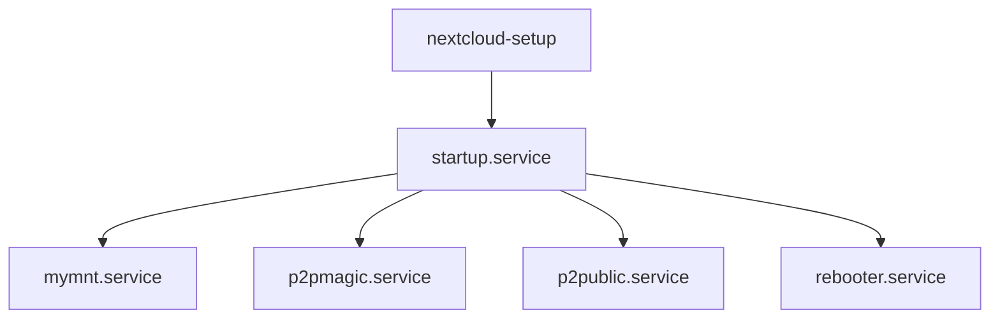

# 🧊 Nixtcloud: Self-Hosted Cloud in One Command

[](https://nixos.org)
[](https://nextcloud.com)
[](https://www.raspberrypi.org)
[](https://www.friendlyelec.com/index.php?route=product/product&product_id=279)
[](https://holesail.io)
[](https://opensource.org/licenses/GPL-3.0)

**Nixtcloud** turns a Raspberry Pi or NanoPi NEO3 into a privacy-first, zero-config personal cloud — powered by [NixOS](https://nixos.org), [Nextcloud](https://nextcloud.com), and peer-to-peer remote access via [Holesail](https://holesail.io). Built for the self-hosting crowd who want full control without constant babysitting.

---

## 💡 Why Nixtcloud?

> **One command. Full cloud. Private, persistent, and portable.**

- **☁️ Full Nextcloud stack**, pre-configured
- **🔐 End-to-end encrypted remote access**, no port forwarding
- **📦 Plug in USB drives**, they're auto-mounted & usable instantly
- **🔁 Self-healing system** with daily reboots and weekly updates
- **📱 Remote access by QR code**, using Holesail

Perfect for digital minimalists, privacy purists, and anyone fed up with Google Drive.

---

## 🚀 Quick Start

### Build for Raspberry Pi 4

From NixOS:
```bash
nix build --system aarch64-linux github:jjacke13/nixtcloud#packages.aarch64-linux.Rpi4
```

From macOS/Linux:
```bash
nix build --extra-experimental-features nix-command --extra-experimental-features flakes \
  --system aarch64-linux github:jjacke13/nixtcloud#packages.aarch64-linux.Rpi4
```

### Build for Raspberry Pi 5

```bash
nix build --system aarch64-linux github:jjacke13/nixtcloud#packages.aarch64-linux.Rpi5
```

### Build for NanoPi NEO3

```bash
nix build --system aarch64-linux github:jjacke13/nixtcloud#packages.aarch64-linux.Nanopi-neo3
```

> **Note for NanoPi NEO3**: Uses a custom minimal kernel (6.18.3) for faster builds and smaller image size (~2.7GB).

Flash the resulting image to an SD card, boot your device, and visit `https://nixtcloud.local`.

---

## 🧰 What You Need

**Hardware**:
- **Raspberry Pi 4 or 5** (≥ 4GB RAM recommended) - supports WiFi + Ethernet
- **OR NanoPi NEO3** (2GB RAM) - Ethernet only, no WiFi
- SD card (16GB+)
- Ethernet connection
- Optional: USB drives for storage expansion

**Software**:
- [Nix](https://nixos.org/download.html)
- SD flashing tool (`dd`, [Etcher](https://balena.io/etcher), etc.)

---

## 🧭 First Use

After flashing and booting your Raspberry Pi:

1. **Power On & Wait**  
   The first boot configures the system — this can take up to **5 minutes**. DO NOT interrupt it. The Pi will reboot automatically when ready.

2. **Connect via Ethernet**
   Make sure your device is connected to your local network via Ethernet. WiFi is supported on Raspberry Pi only (not available on NanoPi NEO3). WiFi setup requires editing `configuration.nix` and rebuilding.

3. **Detect Hostname**  
   From a computer on the same network, open your browser and go to:
   https://nixtcloud.local

   If that doesn't work:
   - Try `ping nixtcloud.local`
   - Or, find the Pi's IP via your router and visit `https://<ip-address>`

4. **Login to Nextcloud**  
   -  Username: `admin`  
   -  Password: `admin`  
   ⚠️ *Change this password immediately* after first login.

5. **Insert USB Storage (Optional)**  
   If you want to expand storage:
   - Plug in a USB drive
   - Wait ~30 seconds
   - It will show up in Nextcloud as external storage

## 🔐 Secure by Design

  - SSH root login disabled by default
  - Firewall restricts all but essential ports
  - Remote access is encrypted, zero-config, and QR-based
  - Weekly auto-updates (or on demand)

---

## 🔄 What Makes It "Self-Healing"?

- Scheduled **maintenance tasks**
- Automatic check and apply of updates and then reboot
- USB drives auto-mount after 30 seconds
- "Magic files" in Nextcloud let you trigger actions like reboot or regenerate P2P credentials by just deleting a file.

---

## 🔌 Plug & Play External Storage

- Works with ext4, exFAT, FAT32, NTFS
- Auto-detected and mounted
- Appears in Nextcloud as external storage
- Supports multiple partitions per device

---

## 🌍 Remote Access, No Router Hacks Required

Using Holesail:
- Encrypted P2P tunnel
- Credentials delivered as `remote.txt` and a QR image inside your Nextcloud
- Public folder sharing via separate connection string

> Want to access your files while traveling without exposing ports? Done.

---

## ⚙️ Easy Customization

Examples (in `configuration.nix`):

```nix
# WiFi (Raspberry Pi only - NanoPi NEO3 has no WiFi)
networking.wireless.enable = true;
networking.wireless.networks = {
  YourSSID = { psk = "YourPassword"; };
};

# Disable daily reboots
services.cron.systemCronJobs = [];

# Set timezone
time.timeZone = "Europe/Berlin";
```

---

## 🧱 Under the Hood

- **NixOS** for immutability and reproducibility
- **Nextcloud 32**
- **Holesail** for P2P remote access
- Custom systemd services:
  - `startup.service`
  - `mymnt.service`
  - `p2pmagic.service`
  - `p2public.service`
  - `rebooter.service`



---

## 🛠️ Troubleshooting

**Can't access `nixtcloud.local`?**
- Try accessing the Pi's IP address directly
- Ensure `avahi`/mDNS is working on your network

**USB drive not showing up?**
- Check if formatted correctly
- Wait 30-45 seconds after plugging in
- Run: `journalctl -u mymnt.service`

**Remote access fails?**
- Make sure Holesail app is installed and working
- Double-check the QR or connection string

---

## 🧪 Local Dev & Testing

```bash
git clone https://github.com/jjacke13/nixtcloud.git
cd nixtcloud

# Build for Raspberry Pi 4
nix build .#packages.aarch64-linux.Rpi4

# Build for Raspberry Pi 5
nix build .#packages.aarch64-linux.Rpi5

# Build for NanoPi NEO3 (faster build, minimal kernel)
nix build .#packages.aarch64-linux.Nanopi-neo3
```

(⚠️ Container-based testing coming soon)

---

## 🙌 Credits

- [Holesail](https://holesail.io) for seamless P2P networking
- [Nextcloud](https://nextcloud.com) for the freedom to host your own cloud
- [NixOS](https://nixos.org) for reproducibility that actually works
- Everyone contributing to open source